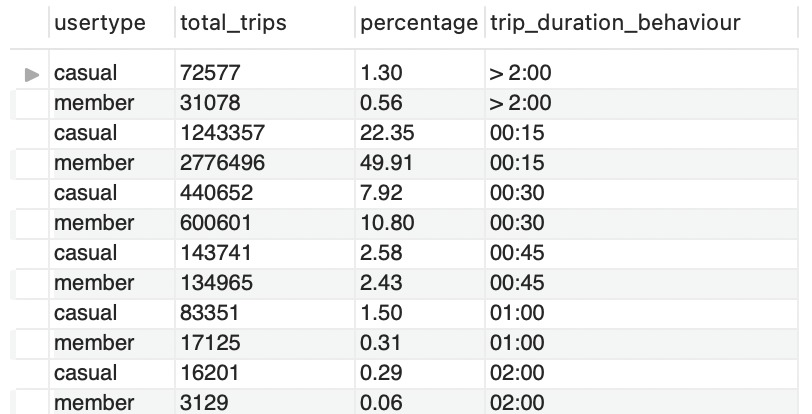
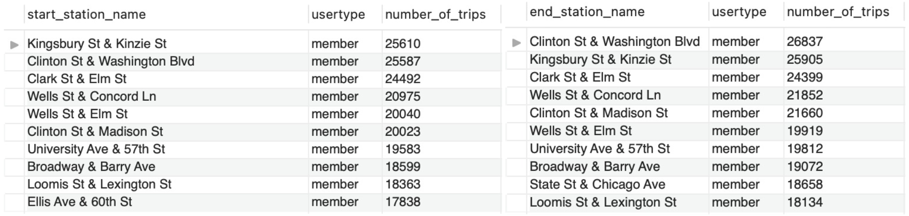

# Google Data Analytics Capstone Project
## Case study: How does a bike-share navigate speedy success? 

This is the capstone project I completed for the [Google Data Analytics Professional Certificate](https://www.coursera.org/professional-certificates/google-data-analytics). In this case study, I analyzed historical data from a fictional Chicago-based bike-share company using MySQL. I crafted visualizations in Tableau to illustrate my findings and concluded by offering recommendations to assist the company in addressing their business queries

For a detailed summary and visual representation of my analysis, please visit the [Tableau Public dashboard](https://public.tableau.com/views/CyclisticBIKESHAREHowdoannualmembersandcasualridersuseCyclisticbikesdifferently/Dashboard?:language=en-GB&:sid=&:display_count=n&:origin=viz_share_link) I have created.

Below, you will find further details on the case study scenario and the full report.

## Scenario
As a junior data analyst at Cyclistic, a bike-share company in Chicago, my task is to maximise annual memberships by understanding the differences in bike usage between casual riders and annual members. My team aims to design a new marketing strategy backed by compelling data insights and professional visualisations. 
					
**About the company**

Cyclistic is a bike-share program based in Chicago. Their customers are classified into two categories: *casual riders*, who buy single-ride or full-day passes, and *members*, who opt for annual memberships.
 								
Financial analysis has demonstrated that annual members are much more profitable than casual riders and the marketing director believes that maximising the number of annual members will be key to future growth. Rather than pursuing a marketing campaign targeting entirely new customers, the focus now shifts towards converting casual riders into members.

## Business Task	
Analyse historical bike trip data to identify trends in how annual members and casual riders use Cyclistic bikes differently, facilitating the design of marketing strategies aimed at converting casual riders into annual members.

## Data Sources
Given that Cyclistic is a fictional company, the data has been made available by Motivate International Inc. under this [licence](https://divvybikes.com/data-license-agreement).

This data is provided according to the [Divvy Data License Agreement](https://divvybikes.com/data-license-agreement) and released on a monthly schedule. Each trip is anonymized and includes:
+ Trip start day and time
+ Trip end day and time
+ Trip start station
+ Trip end station
+ Rider type (Member, Casual)

For this analysis, we’ll be examining Divvy’s bike trip data from last year, 2023. A total of 12 CSV files have been downloaded from [here](https://divvy-tripdata.s3.amazonaws.com/index.html). 

## Data Cleaning and Manipulation 
During this phase, datasets were thoroughly checked for corrupted, duplicate, incomplete, invalid data and they have been fixed accordingly.
MySQL Workbench has been used for this purpose since, given the size of the dataset, processing time is much quicker than with Microsoft Excel. All twelve CSV files corresponding to 2023 have been merged into one table named “2023-cyclistic-tripdata”.

Steps followed for data cleaning:
+ Checked for blanks and invalid data.
+ Checked for unexpected values.
+ Checked for duplicates.
+ Checked if the end date was later than the start date. 

Measures taken to fix errors and prepare the database for analysis:
+ Renamed column "member_casual" to "usertype" for clarity.
+ Created new columns to facilitate analysis: trip_duration_hour, trip_duration_min, trip_duration_sec, trip_hour, trip_time_of_day, trip_day, trip_weekday, trip_weekday_name, trip_month, trip_month_name, trip_season.
+ Deleted rows with trips that lasted less than 1 minute.
+ Fixed blanks in columns: start_station_name, start_station_id, end_station_name and end_station_id, with the text "unknown". 

<details>
  <summary>Click to show SQL queries used for data cleaning.</summary>

```tsql

-- DATA CLEANING & MANIPULATION

-- Creating a copy of the table before editing.
CREATE TABLE copy_2023_cyclistic_tripdata
SELECT *
FROM case_study.`2023-cyclistic-tripdata`;


-- Renaming columns for clarity.
ALTER TABLE `case_study`.`2023-cyclistic-tripdata`
CHANGE COLUMN `member_casual` `usertype` TEXT NULL DEFAULT NULL,
RENAME TO  `case_study`.`2023-cyclistic-tripdata`;


-- Checking for unexpected values.
SELECT DISTINCT
   rideable_type,
   usertype
FROM case_study.`2023-cyclistic-tripdata`;
# Result: 5 row(s) returned


-- Checking for null values.
SELECT
   started_at,
   ended_at,
   ride_id
FROM case_study.`2023-cyclistic-tripdata`
WHERE started_at IS NULL
   OR ended_at IS NULL
   OR ride_id IS NULL;
# Result: 0 row(s) returned


-- Checking for duplicates.
SELECT
COUNT(ride_id)
FROM case_study.`2023-cyclistic-tripdata`;
# Result: 6150470


SELECT
COUNT(DISTINCT ride_id)
FROM case_study.`2023-cyclistic-tripdata`;
# Result: 5712887


-- Identifying duplicates.
SELECT
   ride_id,
   started_at,
   ended_at,
   COUNT(*) AS duplicate_count
FROM case_study.`2023-cyclistic-tripdata`
GROUP BY ride_id, started_at, ended_at
HAVING COUNT(*) > 1
LIMIT 999999;
# Result: 437583 row(s) returned


ALTER TABLE case_study.`2023-cyclistic-tripdata`
ADD COLUMN ID INT AUTO_INCREMENT PRIMARY KEY;


-- Deleting duplicate rows based on ride_id.
DELETE case_study.`2023-cyclistic-tripdata`
FROM case_study.`2023-cyclistic-tripdata`
LEFT JOIN (
   SELECT MIN(ID) AS ID
   FROM case_study.`2023-cyclistic-tripdata`
   GROUP BY ride_id
) AS keep_rows ON case_study.`2023-cyclistic-tripdata`.ID = keep_rows.ID
WHERE keep_rows.ID IS NULL;
# Result: 437583 row(s) affected


-- Validating there are no duplicates.
SELECT
   ride_id,
   started_at,
   ended_at,
   COUNT(*) AS duplicate_count
FROM case_study.`2023-cyclistic-tripdata`
GROUP BY ride_id, started_at, ended_at
HAVING COUNT(*) > 1
LIMIT 999999;
# Result: 0 row(s) returned


-- Creating new columns to facilitate analysis.


ALTER TABLE case_study.`2023-cyclistic-tripdata` -- Calculating trip duration
ADD COLUMN trip_duration_hour INT,
ADD COLUMN trip_duration_min INT,
ADD COLUMN trip_duration_sec INT;


UPDATE case_study.`2023-cyclistic-tripdata`
SET trip_duration_hour = TIMESTAMPDIFF(HOUR,started_at, ended_at),
   trip_duration_min = TIMESTAMPDIFF(MINUTE,started_at, ended_at),
   trip_duration_sec = TIMESTAMPDIFF(SECOND,started_at, ended_at);
# 5712887 row(s) affected Rows matched: 5712887  Changed: 5712887  Warnings: 0


ALTER TABLE case_study.`2023-cyclistic-tripdata` -- Extracting the hour, time of day, day, weekday, month, year from started_at
ADD COLUMN trip_hour INT,
ADD COLUMN trip_time_of_day TEXT,
ADD COLUMN trip_day INT,
ADD COLUMN trip_weekday INT,
ADD COLUMN trip_weekday_name TEXT,
ADD COLUMN trip_month INT,
ADD COLUMN trip_month_name TEXT,
ADD COLUMN trip_season TEXT;


UPDATE case_study.`2023-cyclistic-tripdata`
SET trip_hour = HOUR(started_at),
   trip_time_of_day = CASE
   WHEN HOUR(started_at) BETWEEN 6 and 11 THEN "Morning"
   WHEN HOUR(started_at) BETWEEN 12 and 16 THEN "Afternoon"
   WHEN HOUR(started_at) BETWEEN 17 and 20 THEN "Evening"
   ELSE "Night"
   END,
   trip_day = DAY(started_at),
   trip_weekday = WEEKDAY(started_at), -- 0 for Monday
   trip_weekday_name = DAYNAME(started_at),
   trip_month = MONTH(started_at),
   trip_month_name = MONTHNAME(started_at),
   trip_season = CASE
   WHEN started_at BETWEEN '2023-03-21 00:00:00' AND '2023-06-20 23:59:59' THEN "Spring"
   WHEN started_at BETWEEN '2023-06-21 00:00:00' AND '2023-09-20 23:59:59' THEN "Summer"
   WHEN started_at BETWEEN '2023-09-21 00:00:00' AND '2023-12-20 23:59:59' THEN "Autumn"
   ELSE "Winter"
   END;
# 5712887 row(s) affected Rows matched: 5712887  Changed: 5712887  Warnings: 0


-- Replacing empty cells with the text "unknown" on those cases where station name or station id are missing.
SELECT
COUNT(ID)
FROM case_study.`2023-cyclistic-tripdata`
WHERE start_station_name = "" OR start_station_id = "";
# Result: 875848


UPDATE case_study.`2023-cyclistic-tripdata`
SET start_station_name = "unknown"
WHERE start_station_name = "";
# Result: 875716 row(s) affected Rows matched: 875716  Changed: 875716  Warnings: 0


UPDATE case_study.`2023-cyclistic-tripdata`
SET start_station_id = "unknown"
WHERE start_station_id = "";
# Result: 875848 row(s) affected Rows matched: 875848  Changed: 875848  Warnings: 0


SELECT
COUNT(ID)
FROM case_study.`2023-cyclistic-tripdata`
WHERE end_station_name = "" OR end_station_id = "";
# Result: 922469


UPDATE case_study.`2023-cyclistic-tripdata`
SET end_station_name = "unknown"
WHERE end_station_name = "";
# Result: 922328 row(s) affected Rows matched: 922328  Changed: 922328  Warnings: 0


UPDATE case_study.`2023-cyclistic-tripdata`
SET end_station_id = "unknown"
WHERE end_station_id = "";
# Result: 922469 row(s) affected Rows matched: 922469  Changed: 922469  Warnings: 0


-- Deleting rows with trips that lasted less than 1 minute.
SELECT
COUNT(ID)
FROM case_study.`2023-cyclistic-tripdata`
WHERE trip_duration_min < 1;
# Result: 149614


DELETE FROM case_study.`2023-cyclistic-tripdata`
WHERE trip_duration_min < 1;
# Result: 149614 row(s) affected


-- Checking if end dates are later than start dates.
SELECT
*
FROM case_study.`2023-cyclistic-tripdata`
WHERE ended_at <= started_at;
# Result: 0 row(s) returned
```
</details>

## Analysis
Data analysis was carried out in MySQL and several calculations have been performed in order to analyse data and determine the following: 
+ Count of trips per usertype in 2023, monthly, weekly, daily, hourly.
+ Busiest times for each usertype.
+ Average trip duration per usertype.
+ 10 most popular stations per usertype.
  
<details>
  <summary>Click to show full analysis.</summary>


When examining **bike trips taken in 2023**, we can see that members are notably more active users compared to casual riders, constituting over 64% of the total trips.


<details>
<summary>Show SQL query</summary>
	
```tsql
-- Calculating the total number of trips in 2023 per usertype.
SELECT 
    total_trips,
    total_member_trips,
    total_casual_trips,
    ROUND(total_member_trips/total_trips,2)*100 AS member_percentage,
    ROUND(total_casual_trips/total_trips,2)*100 AS casual_percentage
FROM 
	(
	SELECT
	    COUNT(ID) AS total_trips,
            SUM(CASE WHEN usertype = 'member' THEN 1 ELSE 0 END) AS total_member_trips,
            SUM(CASE WHEN usertype = 'casual' THEN 1 ELSE 0 END) AS total_casual_trips
	FROM case_study.`2023-cyclistic-tripdata`) AS trip_count_per_usertype;
```
</details>

First, let’s take a quick look at the **busiest times** for each usertype and we’ll then delve into each of these.


<details>
<summary>Show SQL query</summary>
	
```tsql
-- Calculating the busiest times for Members.
SELECT 
    member AS usertype,
    busiest_month.trip_month_name AS busiest_month,
    busiest_day.trip_weekday_name AS busiest_day,
    busiest_time.trip_time_of_day AS busiest_time,
    busiest_hour.trip_hour AS busiest_hour
FROM
    (SELECT 
        trip_month_name,
        COUNT(*) AS total_trips
    FROM case_study.`2023-cyclistic-tripdata`
    WHERE usertype = "member"
    GROUP BY trip_month_name
    ORDER BY total_trips DESC
    LIMIT 1) AS busiest_month
    
JOIN
    (SELECT 
        trip_weekday_name,
        COUNT(*) AS total_trips
    FROM case_study.`2023-cyclistic-tripdata`
    WHERE usertype = "member"
    GROUP BY trip_weekday_name
    ORDER BY total_trips DESC
    LIMIT 1) AS busiest_day

JOIN
    (SELECT 
        trip_time_of_day,
        COUNT(*) AS total_trips
    FROM case_study.`2023-cyclistic-tripdata`
    WHERE usertype = "member"
    GROUP BY trip_time_of_day
    ORDER BY total_trips DESC
    LIMIT 1) AS busiest_time
    
    JOIN
    (SELECT 
        trip_hour,
        COUNT(*) AS total_trips
    FROM case_study.`2023-cyclistic-tripdata`
    WHERE usertype = "member"
    GROUP BY trip_hour
    ORDER BY total_trips DESC
    LIMIT 1) AS busiest_hour;

-- Calculating the busiest times for Casuals.
SELECT 
    casual AS usertype,
    busiest_month.trip_month_name AS busiest_month,
    busiest_day.trip_weekday_name AS busiest_day,
    busiest_time.trip_time_of_day AS busiest_time,
    busiest_hour.trip_hour AS busiest_hour
FROM
    (SELECT 
        trip_month_name,
        COUNT(*) AS total_trips
    FROM case_study.`2023-cyclistic-tripdata`
    WHERE usertype = "casual"
    GROUP BY trip_month_name
    ORDER BY total_trips DESC
    LIMIT 1) AS busiest_month
    
JOIN
    (SELECT 
        trip_weekday_name,
        COUNT(*) AS total_trips
    FROM case_study.`2023-cyclistic-tripdata`
    WHERE usertype = "casual"
    GROUP BY trip_weekday_name
    ORDER BY total_trips DESC
    LIMIT 1) AS busiest_day

JOIN
    (SELECT 
        trip_time_of_day,
        COUNT(*) AS total_trips
    FROM case_study.`2023-cyclistic-tripdata`
    WHERE usertype = "casual"
    GROUP BY trip_time_of_day
    ORDER BY total_trips DESC
    LIMIT 1) AS busiest_time
    
    JOIN
    (SELECT 
        trip_hour,
        COUNT(*) AS total_trips
    FROM case_study.`2023-cyclistic-tripdata`
    WHERE usertype = "casual"
    GROUP BY trip_hour
    ORDER BY total_trips DESC
    LIMIT 1) AS busiest_hour;
```
</details>

When analysing **total trips by month**, we can see the annual trend persists, with annual members outnumbering casual riders in each month.

Additionally, both user types exhibit seasonal patterns, experiencing peak demand during summer months and a decline in winter. 


<details>
<summary>Show SQL query</summary>
	
```tsql
-- Calculating the total number of trips per usertype per month.
SELECT 
    trip_month_name,
    total_trips,
    total_member_trips,
    total_casual_trips
FROM 
	(
	SELECT
	    trip_month_name,
	    COUNT(ID) AS total_trips,
            SUM(CASE WHEN usertype = 'member' THEN 1 ELSE 0 END) AS total_member_trips,
            SUM(CASE WHEN usertype = 'casual' THEN 1 ELSE 0 END) AS total_casual_trips
	FROM case_study.`2023-cyclistic-tripdata` 
	GROUP BY trip_month_name) AS trip_count_per_usertype
GROUP BY trip_month_name
ORDER BY total_trips DESC;

```
</details>

When analysing **total trips by day**, we can see that members tend to ride more during weekdays, especially on Thursdays, Wednesdays, and Tuesdays, whereas casual bikers prefer Saturdays, Sundays, and Fridays.


<details>
<summary>Show SQL query</summary>
	
```tsql
-- Calculating the total number of trips per usertype per weekday.
SELECT 
    trip_weekday_name,
    total_trips,
    total_member_trips,
    total_casual_trips
FROM 
	(
	SELECT
	    trip_weekday_name,
	    COUNT(ID) AS total_trips,
            SUM(CASE WHEN usertype = 'member' THEN 1 ELSE 0 END) AS total_member_trips,
            SUM(CASE WHEN usertype = 'casual' THEN 1 ELSE 0 END) AS total_casual_trips
	FROM case_study.`2023-cyclistic-tripdata` 
        GROUP BY trip_weekday_name) AS trip_count_per_usertype
GROUP BY trip_weekday_name
ORDER BY total_trips DESC;
```
</details>

When looking at the **time of the day**, we can see that members ride consistently throughout the day, including morning, afternoon and evening, while casual bikers predominantly ride in the afternoon.


<details>
<summary>Show SQL query</summary>
	
```tsql
-- Calculating the total number of trips per usertype per time of day.
SELECT 
    trip_time_of_day,
    total_trips,
    total_member_trips,
    total_casual_trips
FROM 
	(
	SELECT
	    trip_time_of_day,
	    COUNT(ID) AS total_trips,
            SUM(CASE WHEN usertype = 'member' THEN 1 ELSE 0 END) AS total_member_trips,
            SUM(CASE WHEN usertype = 'casual' THEN 1 ELSE 0 END) AS total_casual_trips
	FROM case_study.`2023-cyclistic-tripdata` 
        GROUP BY trip_time_of_day) AS trip_count_per_usertype
GROUP BY trip_time_of_day
ORDER BY total_trips DESC;
```
</details>

If we take a closer look and analyse the number of **trips per hour**, we can see that members’ bike usage is most frequent between 4 PM and 6 PM, as well as around 8 AM, correlating with typical working hours. Conversely, casual riders' activity peaks between 3 PM and 6 PM, suggesting a preference for leisurely rides during these hours.


<details>
<summary>Show SQL query</summary>
	
```tsql
-- Calculating the total number of trips per usertype per hour.
SELECT 
    trip_hour,
    total_trips,
    total_member_trips,
    total_casual_trips
FROM 
	(
	SELECT
	    trip_hour,
	    COUNT(ID) AS total_trips,
            SUM(CASE WHEN usertype = 'member' THEN 1 ELSE 0 END) AS total_member_trips,
            SUM(CASE WHEN usertype = 'casual' THEN 1 ELSE 0 END) AS total_casual_trips
	FROM case_study.`2023-cyclistic-tripdata` 
        GROUP BY trip_hour) AS trip_count_per_usertype
GROUP BY trip_hour
ORDER BY total_trips DESC
LIMIT 10;
```
</details>

Now, let’s have a look at how members and casual riders use the service differently based on their **average trip duration**.


<details>
<summary>Show SQL query</summary>
	
```tsql
-- Calculating the average trip duration in 2023.
SELECT
	(SELECT
	    ROUND(AVG(trip_duration_min)) 
	FROM case_study.`2023-cyclistic-tripdata`) AS avg_overall_trip_duration_min,
	(SELECT
	    ROUND(AVG(trip_duration_min)) 
	FROM case_study.`2023-cyclistic-tripdata` 
	WHERE usertype = "member") AS avg_member_trip_duration_min,
	(SELECT
	    ROUND(AVG(trip_duration_min)) 
	FROM case_study.`2023-cyclistic-tripdata` 
	WHERE usertype = "casual") AS avg_casual_trip_duration_min;
```
</details>

Given that casual riders hold the bike nearly twice as long as members on average, we need to delve deeper into the data to understand if this disparity is influenced by a peak in trips during a particular **month**. 


<details>
<summary>Show SQL query</summary>
	
```tsql
-- Checking if the difference between usertypes is due to trip peaks in particular months.
SELECT
    usertype,
    trip_month_name,
    ROUND(AVG(trip_duration_min)) AS avg_trip_duration_min
FROM case_study.`2023-cyclistic-tripdata`
WHERE usertype = "member"
GROUP BY usertype, trip_month_name;

SELECT
    usertype,
    trip_month_name,
    ROUND(AVG(trip_duration_min)) AS avg_trip_duration_min
FROM case_study.`2023-cyclistic-tripdata`
WHERE usertype = "casual"
GROUP BY usertype, trip_month_name;

```
</details>

When comparing their average trip durations, we observe consistency throughout the year, with peaks during the summer months, yet still displaying an approximate 10-minute difference between members and casual riders.

If the month is not the determining factor, let’s investigate if there are variations in trip durations based on the **day of the week**.


<details>
<summary>Show SQL query</summary>
	
```tsql
-- Checking if the difference between usertypes is due to trip peaks in particular days of the week.
SELECT
    usertype,
    trip_weekday_name,
    ROUND(AVG(trip_duration_min)) AS avg_trip_duration_min
FROM case_study.`2023-cyclistic-tripdata`
WHERE usertype = "member"
GROUP BY usertype, trip_weekday_name
ORDER BY avg_trip_duration_min DESC;

SELECT
    usertype,
    trip_weekday_name,
    ROUND(AVG(trip_duration_min)) AS avg_trip_duration_min
FROM case_study.`2023-cyclistic-tripdata`
WHERE usertype = "casual"
GROUP BY usertype, trip_weekday_name
ORDER BY avg_trip_duration_min DESC;

```
</details>

Results consistently indicate that casual riders tend to ride twice as long as members on a daily basis, with peaks for both user types observed during weekends.

Let’s delve deeper into this discrepancy by investigating the **maximum trip duration** for each usertype to assess its impact on the average.


<details>
<summary>Show SQL query</summary>

```tsql
-- Checking if the difference between usertypes is due to outliers.
SELECT 
    usertype,
    MAX(trip_duration_hour) AS MAX_trip_duration_hour
FROM case_study.`2023-cyclistic-tripdata`
GROUP BY usertype
ORDER BY MAX_trip_duration_hour DESC;
```
</details>

Ah-ha! The maximum trip duration for casual riders is notably high, with the longest trip recorded at 202 hours. 

Now, let’s determine if this **outlier** significantly influences our average trip duration. We will identify casual riders’ trips exceeding 3 days, assuming these extended durations may be attributed to tourists holding the bike for an entire weekend.


<details>
<summary>Show SQL query</summary>
	
```tsql
-- Checking if the number of outliers is representative to impact on our average trip duration.
SELECT
    usertype,
    total_trips,
    trip_duration_longer_than_3_days,
    ROUND(trip_duration_longer_than_3_days/total_trips*100,2) AS long_trips_percentage
FROM
	(SELECT
	    usertype,
	    COUNT(ID) AS total_trips,
	    SUM(CASE WHEN trip_duration_min > 60*24*3 THEN 1 ELSE 0 END) AS trip_duration_longer_than_3_days
	    FROM case_study.`2023-cyclistic-tripdata`
            GROUP BY usertype) AS trip_count
GROUP BY usertype;
```
</details>

We can conclude that casual riders' average trip duration remains largely unaffected by outliers, as these instances are minimal, constituting only 5 trips, which represent practically 0% of the total trips analysed.

Now, let’s examine the distribution of rides per user type by grouping them into **time intervals**. 

It is evident that both user groups tend to take short rides within 15 minutes, particularly members. However, casual rides surpass member rides when considering trips lasting more than 45 minutes, indicating their preference for longer rides.



<details>
<summary>Show SQL query</summary>
	
```tsql
-- Analysing trip duration per usertype by grouping them in time intervals.
SELECT
    usertype,
    COUNT(ID) AS total_trips,
    ROUND((COUNT(ID) / (SELECT COUNT(*) FROM case_study.`2023-cyclistic-tripdata`)) * 100, 2) AS percentage,
    CASE 
        WHEN trip_duration_min <= 15 THEN '00:15'
        WHEN trip_duration_min BETWEEN 15 AND 30 THEN '00:30'
        WHEN trip_duration_min BETWEEN 31 AND 45 THEN '00:45'
        WHEN trip_duration_hour = 1 THEN '01:00'
        WHEN trip_duration_hour = 2 THEN '02:00'
        ELSE '> 2:00'
    END AS trip_duration_behaviour
FROM case_study.`2023-cyclistic-tripdata`
GROUP BY trip_duration_behaviour, usertype
ORDER BY trip_duration_behaviour;
```
</details>

Let's now examine the **top 10 stations** to identify the most frequently used by each user type.




<details>
<summary>Show SQL query</summary>
	
```tsql
-- Calculating Members' 10 most popular stations to start trips.
SELECT
    start_station_name,
    usertype, 
    COUNT(ID) AS number_of_trips
FROM case_study.2023-cyclistic-tripdata
WHERE usertype = "Member" AND start_station_name != "unknown"
GROUP BY start_station_name
ORDER BY number_of_trips DESC
LIMIT 10;

-- Calculating Members' 10 most popular stations to end trips.
SELECT
    end_station_name,
    usertype, 
    COUNT(ID) AS number_of_trips
FROM case_study.2023-cyclistic-tripdata
WHERE usertype = "Member" AND end_station_name != "unknown"
GROUP BY end_station_name
ORDER BY number_of_trips DESC
LIMIT 10;

-- Calculating Casuals' 10 most popular stations to start trips.
SELECT
    start_station_name,
    usertype, 
    COUNT(ID) AS number_of_trips
FROM case_study.2023-cyclistic-tripdata
WHERE usertype = "Casual" AND start_station_name != "unknown"
GROUP BY start_station_name
ORDER BY number_of_trips DESC
LIMIT 10;

-- Calculating Casuals' 10 most popular stations to end trips.
SELECT
    end_station_name,
    usertype, 
    COUNT(ID) AS number_of_trips
FROM case_study.cyclistic
WHERE usertype = "Casual" AND end_station_name != "unknown"
GROUP BY end_station_name
ORDER BY number_of_trips DESC
LIMIT 10;
```
</details>

It's evident that casual riders and members tend to favour different stations. 

Casual riders notably favour one station above all for starting and ending trips: Streeter Dr. & Grand Avenue. This station records over 44,000 trips initiated and terminated there, significantly surpassing the second and third most popular stations, each with fewer than 29,000 trips. 

In contrast, members display a more balanced distribution, with at least six stations recording between 20,000 and 25,000 trips each.

For a comprehensive visual representation of station distribution, refer to the interactive map available on my [Tableau dashboard](https://public.tableau.com/views/CyclisticBIKESHAREHowdoannualmembersandcasualridersuseCyclisticbikesdifferently/Dashboard?:language=en-GB&:sid=&:display_count=n&:origin=viz_share_link).

</details>

## Visualisations and Key Findings
For a summary and overall visualisation of my full year analysis, please visit the Tableau Public dashboard I have created: [Cyclistic BIKE SHARE | How do annual members and casual riders use Cyclistic bikes differently?](https://public.tableau.com/views/CyclisticBIKESHAREHowdoannualmembersandcasualridersuseCyclisticbikesdifferently/Dashboard?:language=en-GB&:sid=&:display_count=n&:origin=viz_share_link).

Here are the **top 10 key insights** derived from my analysis:
+ Annual members account for 64% of total rides, while casual users constitute 36%.
+ Both member and casual rider activity follows a seasonal trend, peaking in summer and declining in winter.
+ Members' activity consistently surpases casual riders' every month.
+ August is the peak month for members, while casual users peak in July.
+ Members primarily use the service for commuting, with peak activity during weekday rush hours, specifically around 8 AM and 5 PM.
+ Casual users predominantly ride for leisure, with peak activity on weekends, although weekday usage spikes at 5 PM.
+ Casual riders tend to have longer rides than annual members.
+ Average ride durations for both user groups are longer on weekends compared to weekdays.
+ Member rides are spread across various stations, while casual users tend to frequent the same few stations.
+ Casual users' preferred stations are clustered together, often near Chicago's top attractions.

<details>
  <summary>Click to show SQL queries used to create visuals.</summary>

```tsql

-- Creating views to store data for later visualisations.


-- Total number of trips in 2023.
SELECT
   COUNT(ID) AS number_of_trips,
   SUM(CASE WHEN usertype = 'member' THEN 1 ELSE 0 END) AS total_member_trips,
   SUM(CASE WHEN usertype = 'casual' THEN 1 ELSE 0 END) AS total_casual_trips
FROM case_study.`2023-cyclistic-tripdata`;


-- Busiest times per usertype.
-- Members:
SELECT
   busiest_month.trip_month_name AS busiest_month,
   busiest_day.trip_weekday_name AS busiest_day,
   busiest_time.trip_time_of_day AS busiest_time
FROM
   (SELECT
       trip_month_name,
       COUNT(*) AS total_trips
   FROM case_study.`2023-cyclistic-tripdata`
   WHERE usertype = "member"
   GROUP BY trip_month_name
   ORDER BY total_trips DESC
   LIMIT 1) AS busiest_month
  
JOIN
   (SELECT
       trip_weekday_name,
       COUNT(*) AS total_trips
   FROM case_study.`2023-cyclistic-tripdata`
   WHERE usertype = "member"
   GROUP BY trip_weekday_name
   ORDER BY total_trips DESC
   LIMIT 1) AS busiest_day

JOIN
   (SELECT
       trip_time_of_day,
       COUNT(*) AS total_trips
   FROM case_study.`2023-cyclistic-tripdata`
   WHERE usertype = "member"
   GROUP BY trip_time_of_day
   ORDER BY total_trips DESC
   LIMIT 1) AS busiest_time;

-- Casuals:
SELECT
   busiest_month.trip_month_name AS busiest_month,
   busiest_day.trip_weekday_name AS busiest_day,
   busiest_time.trip_time_of_day AS busiest_time
FROM
   (SELECT
       trip_month_name,
       COUNT(*) AS total_trips
   FROM case_study.`2023-cyclistic-tripdata`
   WHERE usertype = "casual"
   GROUP BY trip_month_name
   ORDER BY total_trips DESC
   LIMIT 1) AS busiest_month
  
JOIN
   (SELECT
       trip_weekday_name,
       COUNT(*) AS total_trips
   FROM case_study.`2023-cyclistic-tripdata`
   WHERE usertype = "casual"
   GROUP BY trip_weekday_name
   ORDER BY total_trips DESC
   LIMIT 1) AS busiest_day

JOIN
   (SELECT
       trip_time_of_day,
       COUNT(*) AS total_trips
   FROM case_study.`2023-cyclistic-tripdata`
   WHERE usertype = "casual"
   GROUP BY trip_time_of_day
   ORDER BY total_trips DESC
   LIMIT 1) AS busiest_time;


-- Total number of trips per month.
SELECT
   usertype,
   trip_month_name,
   trip_season,
   COUNT(ID) AS number_of_trips
FROM case_study.`2023-cyclistic-tripdata`
GROUP BY usertype, trip_month_name, trip_season;


-- Total number of trips per day.
SELECT
   usertype,
   trip_weekday_name,
   trip_time_of_day,
   trip_hour,
   COUNT(ID) AS number_of_trips
FROM case_study.`2023-cyclistic-tripdata`
GROUP BY usertype, trip_weekday_name, trip_time_of_day, trip_hour;


-- Average trip duration in 2023 per usertype.
SELECT
   usertype,
   ROUND(AVG(trip_duration_min)) AS avg_trip_duration_min
FROM case_study.`2023-cyclistic-tripdata`
GROUP BY usertype;


-- Trip duration per usertype grouped in time intervals.
SELECT
   usertype,
   COUNT(ID) AS number_of_trips,
   ROUND((COUNT(ID) / (SELECT COUNT(*) FROM case_study.`2023-cyclistic-tripdata`)) * 100, 2) AS percentage,
   CASE
       WHEN trip_duration_min <= 15 THEN '00:15'
       WHEN trip_duration_min BETWEEN 15 AND 30 THEN '00:30'
       WHEN trip_duration_min BETWEEN 31 AND 45 THEN '00:45'
       WHEN trip_duration_hour = 1 THEN '01:00'
       WHEN trip_duration_hour = 2 THEN '02:00'
       ELSE '> 2:00'
   END AS trip_duration_behaviour
FROM case_study.`2023-cyclistic-tripdata`
GROUP BY trip_duration_behaviour, usertype
ORDER BY trip_duration_behaviour;


-- Top 100 Stations to start trips.
SELECT
   DISTINCT start_station_name,
   SUM(CASE WHEN trip_id = trip_id AND start_station_name = start_station_name THEN 1 ELSE 0 END) AS total_trips,
   SUM(CASE WHEN usertype = 'member' AND start_station_name = start_station_name THEN 1 ELSE 0 END) AS member_trips,
   SUM(CASE WHEN usertype = 'casual' AND start_station_name = start_station_name THEN 1 ELSE 0 END) AS casual_trips,
   start_lat,
   start_lng
FROM case_study.`2023-cyclistic-tripdata`
WHERE start_station_name <> "unknown"
GROUP BY start_station_name, start_lat, start_lng
ORDER BY total_trips DESC
LIMIT 100;
```
</details>


## Recommendations
Based on the insights above, there are three primary areas Cyclistic should focus on when designing their marketing campaign aiming to convert casual riders into annual members. 

+ **Timing.**

  Marketing campaigns should be launched in Spring and run throughout Summer as this period witnesses heightened demand from casual riders.
  It could be advantageous to promote the campaign before the peak season, particularly if early sign-ups are rewarded with discounts or other incentives.

+ **Tailored Messaging.**

  Effective communication of the benefits of purchasing an annual membership to casual riders is crucial. Recognizing their distinct usage patterns, with casual riders typically engaging in leisure activities while members primarily commute, allows for tailored messaging. 
  Providing perks like discounted rates for members on weekends and longer rides can serve as incentives for casual riders to opt for the membership.

+ **Reach.**

  To maximise campaign effectiveness, efforts should be made to reach as many casual riders as possible. This entails considering their busiest times and preferred stations, ensuring that marketing initiatives are strategically placed to capture their attention and interest.


